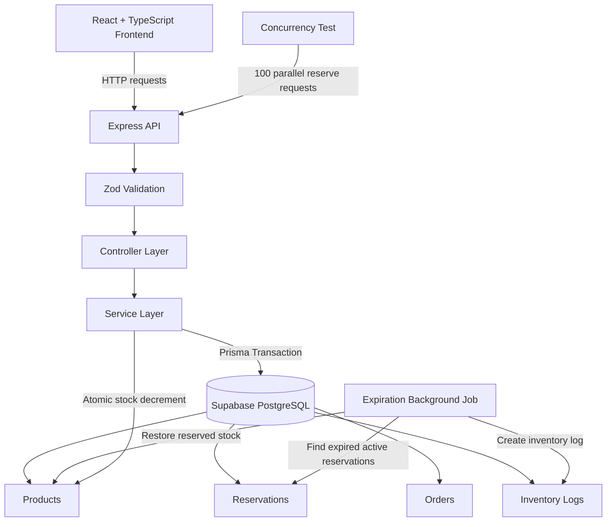
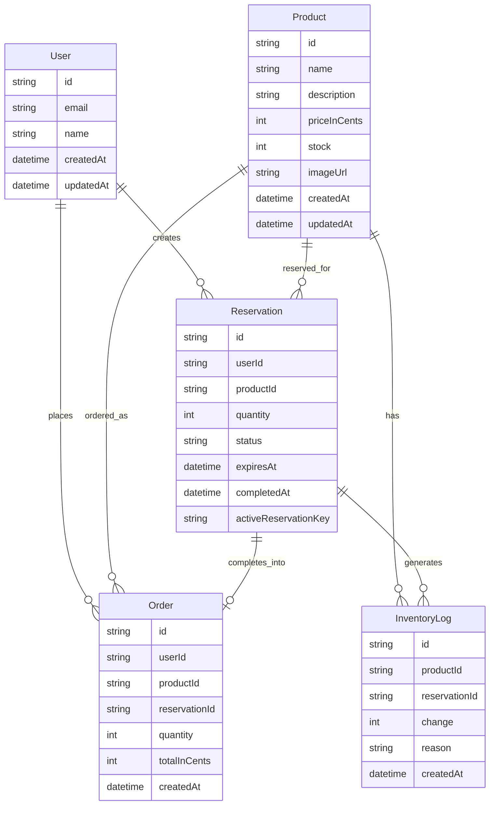

# Limited Stock Reservation System

A full-stack limited-stock product drop system built with Node.js, TypeScript, Prisma, PostgreSQL and React.

The goal of this project is to safely handle concurrent product reservations without overselling. Users can reserve a limited-stock product for 5 minutes, complete checkout, or lose the reservation if it expires.

## Live Demo

Frontend: https://limited-stock-drop-webb.pxxl.click
Backend API: https://limited-stock-drop-api.pxxl.click
GitHub Repository: GitHub Repository: https://github.com/gitkoismail/limited-stock-drop
Loom Video: (https://www.loom.com/share/44370191a2154cb88ee891881b7a7ca9)

---

## Tech Stack

### Backend

* Node.js
* Express
* TypeScript
* Prisma
* PostgreSQL
* Zod
* Pino HTTP Logger
* Helmet
* CORS
* Express Rate Limit

### Frontend

* React
* TypeScript
* Vite
* Custom Hooks
* CSS

### Database

* PostgreSQL hosted on Supabase

---

## Core Features

* Limited stock product reservation
* 5-minute reservation expiration
* Checkout flow
* Automatic stock restoration for expired reservations
* Race condition prevention
* Transaction-based stock updates
* Inventory audit logs
* Request logging
* Centralized error handling
* Zod validation
* Metrics endpoint
* Health check endpoint
* Pagination, filtering and sorting
* Concurrency simulation test

---

## Main Flow

1. User opens the Limited Drop Page.
2. Product information and remaining stock are displayed.
3. Stock is refreshed every 5 seconds.
4. User clicks Reserve.
5. Backend checks availability and reserves the product.
6. Stock is decremented inside a database transaction.
7. Reservation is valid for 5 minutes.
8. User can complete checkout.
9. If checkout is completed, an order is created.
10. If reservation expires, the background job restores the stock.

---

## Database Models

The system uses the following main models:

* User
* Product
* Reservation
* Order
* InventoryLog

### Why this schema?

The schema separates product stock, reservations, orders and inventory logs.

`Product` stores the available stock.

`Reservation` represents a temporary stock lock. It has a status field such as `ACTIVE`, `COMPLETED` or `EXPIRED`.

`Order` is created only after checkout succeeds.

`InventoryLog` keeps an audit trail of stock-related events such as reservation creation, expiration and checkout completion.

This makes the system easier to debug and explain because every stock movement can be traced.

---

## How Race Conditions Are Handled

Race conditions are handled by using database transactions and atomic stock updates.

When a reservation request arrives, the backend performs the stock decrement inside a transaction.

The critical stock update uses a conditional update:

```ts
await tx.product.updateMany({
  where: {
    id: productId,
    stock: {
      gte: quantity,
    },
  },
  data: {
    stock: {
      decrement: quantity,
    },
  },
});
```

This means stock is decremented only if enough stock is available.

If stock is not available, the update count is zero and the reservation fails safely.

The transaction uses Serializable isolation. If PostgreSQL detects a serialization conflict under high concurrency, the backend retries the operation with a small backoff.

This prevents overselling while still allowing available stock to be fully reserved.

---

## Concurrency Test Result

The system was tested with 100 concurrent reservation requests against a product with stock 10.

Result:

```txt
Total requests: 100
Successful reservations: 10
Failed reservations: 90
Active reservations in DB: 10
Final stock: 0

PASS: Overselling prevented successfully.
```

This proves that the system does not oversell and stock never becomes negative.

---

## API Endpoints

### Health Check

```http
GET /api/health
```

### Metrics

```http
GET /api/metrics
```

### Products

```http
GET /api/products
GET /api/products/:productId
```

Supports:

```txt
pagination
filtering
sorting
```

Example:

```http
GET /api/products?page=1&limit=10&sort=stock&order=asc&inStock=true
```

### Reservation

```http
POST /api/reservations/reserve
GET /api/reservations/:reservationId
```

Example body:

```json
{
  "userId": "user-id",
  "productId": "product-id",
  "quantity": 1
}
```

### Checkout

```http
POST /api/checkout
```

Example body:

```json
{
  "reservationId": "reservation-id"
}
```

---

## Background Job

The backend includes an internal background job that periodically checks for expired active reservations.

When an active reservation expires, the job:

1. Marks the reservation as `EXPIRED`
2. Restores the reserved stock
3. Clears the active reservation key
4. Writes an inventory log entry

For this project, the background job runs inside the Node.js process.

In production, this should be moved to a dedicated worker, queue system or external cron job.

---

## Trade-offs

The project uses an internal scheduler instead of a separate worker service to keep the deployment simple.

Authentication is simplified with a demo user instead of a full JWT-based auth flow.

The frontend is focused on the limited drop flow instead of building a full e-commerce store.

The system uses polling every 5 seconds for stock updates instead of WebSockets. This is simpler and reliable enough for the scope of the test.

---

## What Would Break at 10,000 Concurrent Users?

At 10,000 concurrent users, the main bottlenecks would be:

* Database connection limits
* Transaction contention on the same product row
* Node.js process capacity
* Internal scheduler reliability
* Polling load from frontend clients

Because all users are trying to reserve the same product, the product row becomes a hot row in the database.

---

## How I Would Scale It

To scale this system, I would:

* Move expiration logic to a dedicated worker
* Use a queue system such as BullMQ or RabbitMQ
* Add Redis for short-lived reservation locks
* Use horizontal backend scaling
* Add database connection pooling
* Add read replicas for product reads
* Replace polling with WebSocket or Server-Sent Events for real-time stock updates
* Add monitoring and alerting
* Add idempotency keys for reservation and checkout requests

---

## Local Setup

### Backend

```bash
cd backend
npm install
npm run prisma:migrate -- --name init
npm run reset:demo
npm run dev
```

Backend runs on:

```txt
http://localhost:5000
```

### Frontend

```bash
cd frontend
npm install
npm run dev
```

Frontend runs on:

```txt
http://localhost:5173
```

---

## Environment Variables

### Backend

Create `backend/.env`:

```env
PORT=5000
NODE_ENV=development
DATABASE_URL=your_postgresql_connection_string
FRONTEND_URL=http://localhost:5173
```

### Frontend

Create `frontend/.env`:

```env
VITE_API_URL=http://localhost:5000/api
```

No secrets are hardcoded in the source code.

---

## Useful Scripts

### Backend

```bash
npm run dev
npm run build
npm run reset:demo
npm run test:concurrency
```

### Frontend

```bash
npm run dev
npm run build
```

---

## Testing

The backend includes a concurrency simulation script.

Run backend server first:

```bash
cd backend
npm run dev
```

Then run:

```bash
npm run test:concurrency
```

Expected result:

```txt
Successful reservations: 10
Failed reservations: 90
Final stock: 0
PASS: Overselling prevented successfully.
```

---

## Architecture Overview



The reservation flow is protected by transaction-based atomic stock updates. This prevents overselling when many users try to reserve the same limited-stock product at the same time.

Expired reservations are processed by a scheduled backend job. If a reservation is not checked out within 5 minutes, the job marks it as expired, restores the reserved stock, and writes an inventory log. Stock restoration may happen shortly after the countdown reaches zero depending on the job interval.

## Database Relationship Diagram



